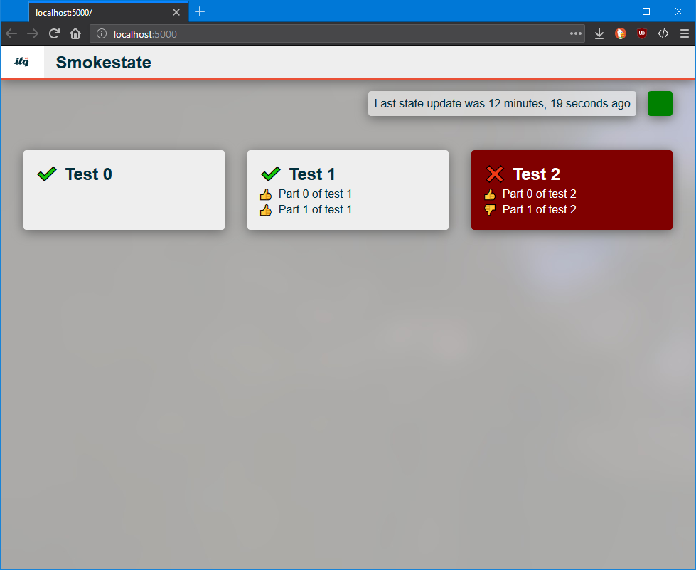

# ITQ Smoketester dashboard and tester

The repo contains all the source for a dashboard and smoketesting client.

### Getting the dashboard up and running:
- [Install Elm 0.19](https://guide.elm-lang.org/install.html)
- [Install .NET Core 2.2](https://dotnet.microsoft.com/download)
- Run `elm make elm\Main.elm elm\Model.elm elm\View.elm elm\TestResult\Model.elm --output wwwroot\js\main.js`
- Run `dotnet run` (or `dotnet watch run`)
- Browse to [`localhost:5000`](http://localhost:5000)

### Getting the tester up and running:
- Have .NET Core installed
- Add any tests you might want to run to the appsettings.json
- Run `dotnet run`

## Dashboard

The dashboard receives its data from the canary test client in the following format:

    [{
      "key": "test0",
      "result": true,
      "name": "Test 0"
    },
    {
      "key": "test1",
      "result": true,
      "name": "Test 1",
      "results": [{
        "result": true,
        "name": "Part 0 of test 1"
      },
      {
        "result": true,
        "name": "Part 1 of test 1"
      }]
    },
    {
      "key": "test2",
      "result": false,
      "name": "Test 2",
      "results": [{
        "result": true,
        "name": "Part 0 of test 2"
      },
      {
        "result": false,
        "name": "Part 1 of test 2",
        "error": "An error occurred in part 1 of test 2"
      }]
    }]

An array that contains objects that describe test results. When the dashboard receives results they are pushed to the UI via a websocket. There are 2 variants as seen above. A simple object describing a passed or failed test and an object that has an array of sub-results that have their own result and name.

The dashboard webserver exposes an endpoint at `/api/smokestate` where clients can post their data. As long as the data is in the format described above, it will accept it.

## Canary (test client)

The testclient is a console app that runs `HTTP GET` requests agains endpoints at a specified interval. These tests can be configured in `appsettings.json` or via environment variables:

appsettings.json:

    {
        "Tests": [
            {
                "Key": "itq_nl",
                "Name": "ITQ.nl site",
                "Url": "https://www.itq.nl",
                "TestIntervalInMinutes": 5
            }
        ]
    }

environment variables: (example in Powershell)

    $env:Tests:0:Key="itq_nl"
    $env:Tests:0:Name="ITQ.nl site"
    $env:Tests:0:Url="https://www.itq.nl"
    $env:Tests:0:TestIntervalInMinutes=5

It also needs a host to send the test result to, it can be configured in the same locations as the tests.

    {
        "DashboardSmokeStateEndpoint": "http://localhost:5000",
    }

See `appsettings.Development.json` for a full example.

## Cloud Foundry deployment

There's a Powershell script included that can deploy a working system from this source (See `push.ps` for all the steps). Make sure that you set up tests after deployment to CF has completed because the default settings do not contain any tests. The quikest way is to use `cf set-env` and add environment variables. Restart the app when all the tests are added.

## **Please review the `manifest.yml` file before pushing to make sure everything is configured to your needs!!**

###### Todo:

- Elm buildpack for the front-end build step. Running push.ps1 to push to CF now relies on a local build step before running the `cf push` command.
- Add more testrunners?